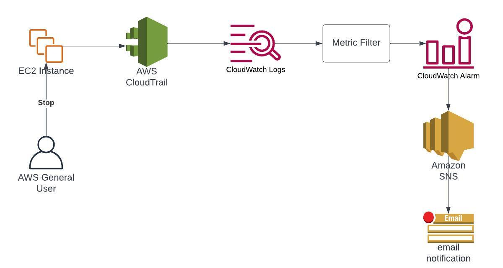

One really great feature of Amazon CloudWatch is that we can get metrics for how often various logs occur. 

This is useful since we can use the metrics to trigger alerts or simply monitor in our dashboards for increased observability.

We achieve this using so-called “metric filters”.

It’s just what you would expect: a filter syntax for incoming logs where matching log entries result in the metric increasing.

Also, this can be used in combination with CloudTrail events.

All API actions taken by users and roles in your accounts against your AWS services are registered as CloudTrail events.

So we can export our CloudTrail events to CloudWatch, create a metric filter matching various log entries, and receive alerts based on these metrics.

# Architecture Overview



1. An AWS user stops an EC2 instance
2. The API action is logged to CloudTrail as a management event
3. The CloudTrail event is exported to a CloudWatch log group
4. A Metric Filter filters the incoming logs, and matches with the entry for the stopped ec2 instance
5. The alarm is triggered from the Metric Filter
6. The alarm notifies an SNS topic which sends an email notification

# Creating the CloudTrail Trail and CloudWatch Log Group

To start off we need a CloudWatch Log Group to export our CloudTrail logs to.

```bash
aws logs create-log-group \
  --log-group-name CloudTrailLogs

aws logs describe-log-groups
```

Make sure to save the ARN for later. We will need it to create the export to CloudWatch from CloudTrail.

Now, let’s create the IAM role for CloudTrail to use for the export.

```bash
echo '{
  "Version": "2012-10-17",
  "Statement": [
    {
      "Sid": "",
      "Effect": "Allow",
      "Principal": {
        "Service": "cloudtrail.amazonaws.com"
      },
      "Action": "sts:AssumeRole"
    }
  ]
}' > cloudtrail-trust.json

aws iam create-role \
  --role-name CloudTrailCloudWatchExportRole \
  --assume-role-policy-document file://cloudtrail-trust.json
```

Copy the returned ARN, just like we did with the log group ARN. Now, let’s add the relevant IAM permissions.

```bash
echo '{
  "Version": "2012-10-17",
  "Statement": [
    {

      "Sid": "CloudTrailCloudWatchExportPolicy",
      "Effect": "Allow",
      "Action": [
        "logs:CreateLogStream",
        "logs:PutLogEvents"
      ],
      "Resource": [
        "arn:aws:logs:eu-central-1:account-id:log-group:CloudTrailLogs:*"
      ]
    }
  ]
}' > cloudtrail-cloudwatch-export-policy.json

aws iam put-role-policy \
  --role-name CloudTrailCloudWatchExportRole \
  --policy-name cloudtrail-cloudwatch-export-policy \
  --policy-document file://cloudtrail-cloudwatch-export-policy.json
```

There, the setup is complete. You should already have a default CloudTrail Trail in your account (AWS creates it for you), so let’s just update that to export it’s logs to CloudWatch.

```bash
aws cloudtrail update-trail \
  --name management-events \
  --cloud-watch-logs-log-group-arn <log group arn> \
  --cloud-watch-logs-role-arn <iam role arn>
```

Check the log group in CloudWatch and note that log streams are being created.

# Create the Metric Filter

We already have everything setup to create the metric filter. The command looks quite long, but once you go through the arguments it’s really quite intuitive.

```bash
aws logs put-metric-filter \
  --log-group-name CloudTrailLogs \
  --filter-name StoppedEc2Instances \
  --filter-pattern '{ $.eventName="StopInstances" }' \
  --metric-transformations metricName=StoppedEc2Instances,metricNamespace=LogMetrics,metricValue=1
```

`--log-group-name`: The log group to apply the metric filter to

`--filter-name`: Just any name we want to later identify our metric filter by

`--filter-pattern`: We only want to match events where the eventName property is set to StopInstances. If you’re unsure what to match against I recommend simply generating the event and looking in CloudTrail

`--metric-transformations`: Basic information like name and namespace for the metric we will be creating from the metric filter

You can see the metric filter by choosing the “Metric filters” tab once you’ve selected the log group and it has links to the metric and metric namespace created.

# Create the Alarm and SNS Topic

Now we’re almost done, we just need to setup the alarm and for that we need an SNS topic.

```bash
aws sns create-topic --name MyTopic

aws sns subscripe \
  --topic-arn <sns arn> \
  --protocol email \
  --notification-endpoint <your email>
```

After setting up the SNS topic, make sure to accept the confirmation email sent to your account.

Now again the next command is a bit of a long one, but don’t worry. We’ll be going through it step by step.

```bash
aws cloudwatch put-metric-alarm \
        --alarm-name ec2-instances-stopped \
        --alarm-description "Alarm when an EC2 instance is stopped" \
        --metric-name StoppedEc2Instances \
        --namespace LogMetrics \
        --statistic Sum \
        --period 300 \
        --threshold 1 \
        --comparison-operator GreaterThanOrEqualToThreshold  \
        --evaluation-periods 1 \
        --alarm-actions <sns arn>
```

`--alarm-name`: Simply a name for the alarm

`--alarm-description`: Just a description

`--metric-name`: The metric the alarm is based on (same as we provided in the metric filter)

`--namespace`: The namespace of the metric (again, same as metric filter)

`--statistic`: We want to simply check the sum, but other metrics might use for instance average 

`--period`: We choose 5 minutes since we will only be using basic monitoring for our EC2 instance which sends metrics every 5 minutes

`--threshold`: Set it to 1 so we get an alarm as soon as a single instance is stopped

`--comparison-operator`: Default is GreaterThanThreshold which isn’t what we want

`--evaluation-periods`: If the comparison holds true for a single period, we want to be alerted

`--alarm-actions`: The SNS topic we configured

Awesome, now go to the alarms section in CloudWatch to see the alarm.

# Launch an EC2 Instance and Stop It

Let’s use a trick to get the latest Amazon Linux 2 AMI

```bash
aws ssm get-parameters \
  --names /aws/service/ami-amazon-linux-latest/amzn2-ami-hvm-x86_64-gp2 \
  --region eu-central-1
```

Make sure to update the region to your own region. It can be handy to save an alias for this command in your terminal for quick reference.

Now, let’s launch the instance and copy the instance id from the response.

```bash
aws ec2 run-instances \
  --image-id <ami> \
  --instance-type t3.micro
```

Wait a couple seconds, and then stop it to generate the CloudTrail API call which is exported to CloudWatch and triggers our metric filter alarm.

```bash
aws ec2 stop-instances \
    --instance-ids i-1234567890abcdef0
```

Wait a little while, and then you should be seeing your alarm is in the “in alarm” state and if you check your email you’ve received a notification.

If you want to have a look at the event, simply search using our metric filter query { $.eventName="StopInstances" } in the log group for the CloudTrailLogs.

# Cleaning Up

Well that was a ton of tun, thanks for reading.

Make sure to clean up the resources so you don’t incur any unnecessary costs, here’s a checklist so you don’t forget anything:
- Terminate the EC2 instance
- Update the CloudTrail Trail to no longer export to CloudWatch
- Delete the CloudWatch Log Group
- Delete the SNS Topic