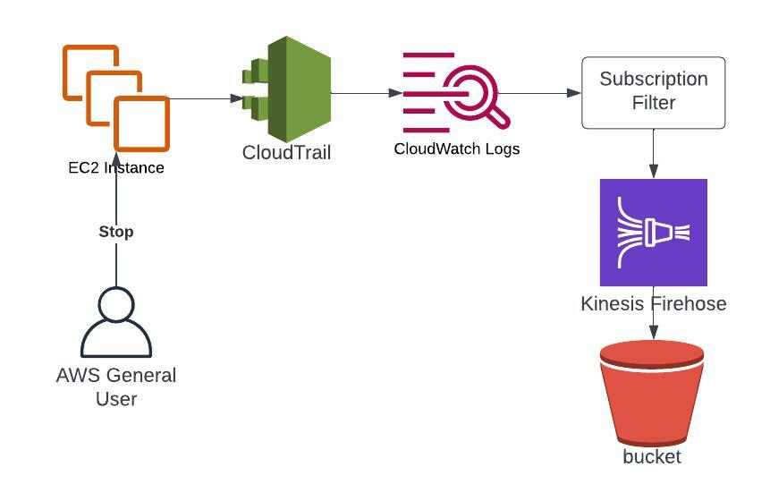

Sometimes we want to stream our logs to other destinations than CloudWatch.

For instance, in a larger organization we might want to stream logs from multiple accounts to an OpenSearch service running in a central account.

To accomplish this we can use subscription filters.

You apply the subscription filter to one or more log groups and using the filter syntax limit what information gets exported.

In this article we’ll go through a simpler use case where we stream a single log group to AWS Firehose, but the setup is quite similar for cross account uses.

We will be filtering for events of EC2 instances being stopped. This requires that you have CloudTrail active forwarding events to CloudWatch.

See my article on CloudWatch Metric Filters for information on how to set this up.

# Architecture Overview



1. A user stops an EC2 instance
2. CloudTrail events are exported to a CloudWatch log group
3. The log group subscription filter matches the event 
4. The log entry is sent to firehose
5. Firehose outputs the messages into an s3 bucket

# Create an S3 Bucket

To start us off we will need our destination bucket where firehose will output our events.

```bash
aws s3api create-bucket --bucket my-bucket \
    --create-bucket-configuration LocationConstraint=<your region>
```

We make sure the bucket is in our default region to not incur any extra networking costs.

# Create IAM Role for Firehose

We create the mandatory role for firehose to use.

```bash
echo '{
  "Statement": {
    "Effect": "Allow",
    "Principal": { "Service": "firehose.amazonaws.com" },
    "Action": "sts:AssumeRole"
    } 
}' > FirehoseTrustPolicy.json
aws iam create-role \
 --role-name FirehoseCWExportRole \
 --assume-role-policy-document file://FirehoseTrust.json
```

And apply the necessary policies for access to our S3 bucket.

```bash
echo '{
  "Statement": [
    {
      "Effect": "Allow",
      "Action": [ 
          "s3:AbortMultipartUpload", 
          "s3:GetBucketLocation", 
          "s3:GetObject", 
          "s3:ListBucket", 
          "s3:ListBucketMultipartUploads", 
          "s3:PutObject" ],
      "Resource": [ 
          "arn:aws:s3:::my-bucket", 
          "arn:aws:s3:::my-bucket/*" ]
    }
  ]
}' > FirehoseS3Policy.json
aws iam put-role-policy \
  --role-name FirehoseCWExportRole \
  --policy-name FirehoseS3Permission \
  --policy-document file://FirehoseS3Policy.json
```

# Create Firehose Delivery Stream

And now we are ready to setup the actual firehose delivery stream.

```bash
aws firehose create-delivery-stream \
   --delivery-stream-name 'my-delivery-stream' \
   --s3-destination-configuration \
  '{"RoleARN": "<firehose role arn>", "BucketARN": "<bucket arn>"}'
```

Allow CloudWatch to Push to Firehose

We also need to setup IAM permissions for CloudWatch to be allowed to push our filtered logs to firehose.

```bash
echo '{
  "Statement": {
    "Effect": "Allow",
    "Principal": { "Service": "logs.amazonaws.com" },
    "Action": "sts:AssumeRole",
    "Condition": { 
         "StringLike": { 
             "aws:SourceArn": "arn:aws:logs:region:accountid:*"
         } 
     }
  }
}' > CWTrust.json

aws iam create-role \
    --role-name CWtoFirehoseRole \
    --assume-role-policy-document file://CWTrust.json
```

Here the condition statement is very important to avoid the confused deputy problem.

Basically if you don’t add the Condition, you would be allowing cloudwatch logs from any account to assume the role.

So if an attacker could social engineer or somehow guess your role ARN and firehose ARN, they could export their CW logs to your firehose delivery stream.

# Create the Subscription Filter

Now we have everything setup to create the subscription filter.

```bash
aws logs put-subscription-filter \
    --log-group-name "CloudTrail" \
    --filter-name "StoppedInstances" \
    --filter-pattern '{ $.eventName="StopInstances" }' \
    --destination-arn <firehose arn> \
    --role-arn <cw role arn>
```

# Test the Solution

First we launch and stop an EC2 instance

```bash
aws ec2 run-instances \
 --image-id <ami> \
 --instance-type t3.micro

aws ec2 stop-instances --instance-ids <instance id>
```

Now, go to the bucket and there should be a file delivered from firehose (this might take a couple of minutes).
1. Choose the option “Query with S3 Select”.
2. On the following page, under Input Settings fill in the following:
3. Set Format to JSON
4. Leave JSON content types as Lines
5. For Compression choose GZIP
6. And under Output Settings set Format to JSON.
7. And have a look at the event that was exported to S3.

# Cleaning Up

We got to play around with a couple fun services in this one, hope you enjoyed using firehose and the added bonus of using S3 Select to query the data.

When your done playing around I suggest you delete the resources you won’t be needing anymore:
- Terminate the EC2 instance
- Delete the Firehose Delivery Stream
- Delete the CloudWatch Subscription Filter
- Delete the bucket

Thanks for reading!