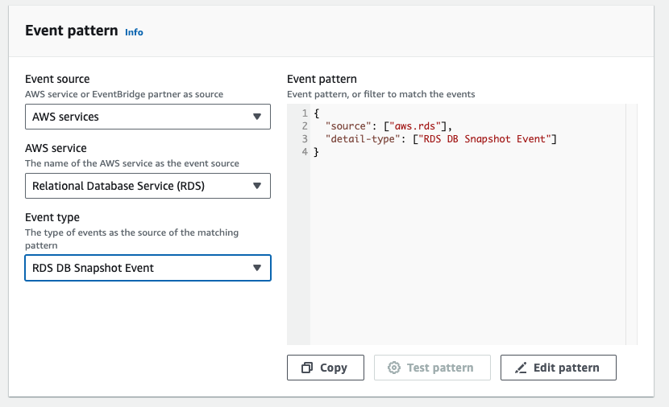
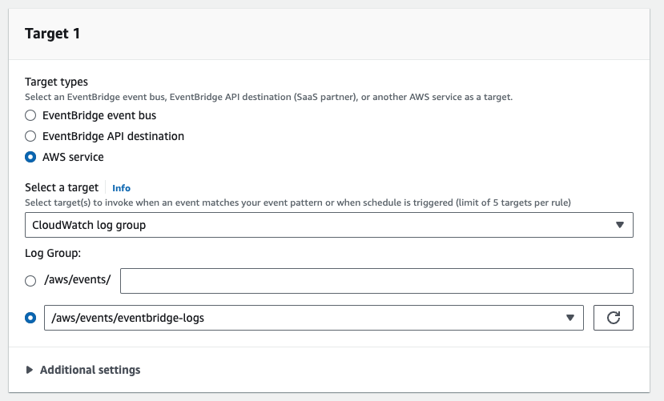
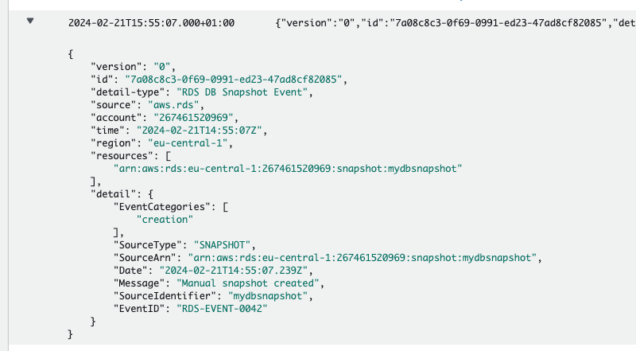
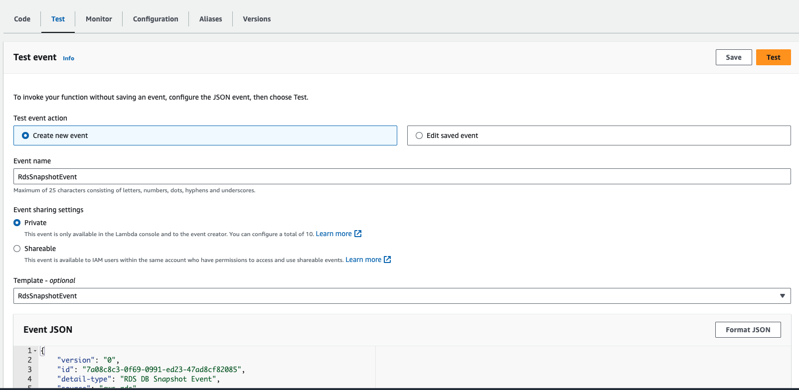

It can be difficult to debug eventbridge events, but luckily there is a way to view the events that reach eventbridge.

We create a separate rule and filter pattern and send the events to cloudwatch.

In this mini project I'll go through how.

# Creating a Logging Rule
Go to EventBridge in the AWS Console and create a new rule with the desired filter pattern.

1. Under `AWS Service` choose the service you want to receive logs for.
2. Under `Event Type` choose the type of event to filter for.

On the next page we configure the target for the Rule.

1. Under `Target Types` select `AWS Service`
2. By `Select Target` select `CloudWatch log group` in the dropdown
3. Under `Log Group` you can specify your name for a new log group
4. Save the configuration

Then, just wait for the events to come in, and have a look at them by inspecting the logs in cloudwatch.

# Inspecting the Filtered Events

Go to your log group in CloudWatch, select a log stream and review the logs.

# Using the Logs to Test Lambda

One very handy usecase for these log entries is to test our Lambda functions.

Simply copy an event you want to test, and paste it as json input for your lambda test.

1. Go to your Lambda function and choose the `Test` tab
2. Create a new event
3. Paste the json you copied from CloudWatch Logs
4. Save and run the test!