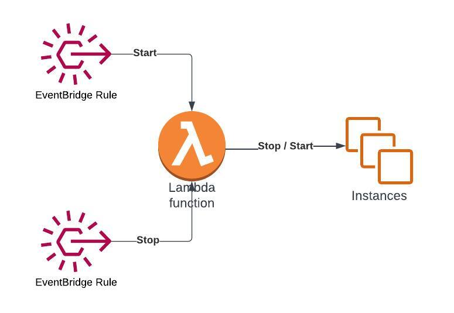
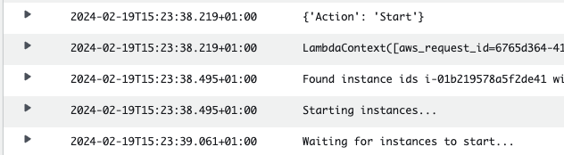

One of my favorite types of AWS projects are event driven architectures.

There’s something so rewarding with having various managed AWS services working together to create automations with just a couple lines of code to maintain.

The cornerstone of these types of projects are Lambda Functions and EventBridge.

EventBridge has two main usages:
- Managed AWS services publish EventBridge messages which we can listen for and respond to
- Creating cron jobs to fire an event on a schedule

In this project we’ll be going through the second option.

# Architecture Overview



1. Two separate EventBridge rules are triggered on a fixed schedule
2. The first one fires a start event, and the second a stop event
3. The lambda function handles both actions and performs the action on the EC2 instances
4. We will be tagging our instances and only performing stop / start on the desired tags

# Create the Lambda Function

We don’t want to be starting and stopping all our EC2 instances, instead we want to restrict ourselves to a specified tag. We will be using the key “Scheduled” and value “OfficeHours”.  

This is to simulate a pretty real world use case of stopping for instance dev machines outside of office hours as a way to save on costs.

```python
import boto3

client = boto3.client('ec2')
TAG_KEY, TAG_VALUE = ['Scheduled', 'OfficeHours']
```

First we simply import our only required library and setup our constants to avoid any magic strings in our code.

```python
def lambda_handler(event, context):
   print(event)
   print(context)


   filter = [{
      'Name': f'tag:{TAG_KEY}', 
      'Values': [TAG_VALUE]
   }]
  
   response = client.describe_instances(Filters=filter)
```

We use the constants to filter the describe_instances call for our tagged instances.

```python
   instance_ids = []
   for reservation in response['Reservations']:
       for instance in reservation['Instances']:
           instance_ids.append(instance['InstanceId'])

   if not instance_ids:
       exit()
```

We extract the instance IDs from the response, and exit out of the script if we don’t have any EC2 instances with the appropriate tag.

```python
   if event['Action'] == 'Start':
       start_instances(instance_ids)
   elif event['Action'] == 'Stop':
       stop_instances(instance_ids)
   else:
       print(f'Unknown action {event["Action"]} provided by event.')
```

Finally we check if the lambda is scheduled to start or stop EC2 instances with the “Action” parameter. 

Let’s take a look at the two functions.

```python
def start_instances(instance_ids):
   client.start_instances(InstanceIds=instance_ids)
   waiter = client.get_waiter('instance_running')
   waiter.wait(InstanceIds=instance_ids)
```

We simply pass the instance IDs to the start_instances method, but then use the appropriate waiter to wait for the instances to start.

If you haven’t used boto3 waiters before I encourage you to check the documentation. They’re really useful.

```python
def stop_instances(instance_ids):
   client.stop_instances(InstanceIds=instance_ids)
   waiter = client.get_waiter('instance_stopped')
   waiter.wait(InstanceIds=instance_ids)
```

For stopping the instances the code is almost exactly the same.

# Create Lambda IAM Role

To run our Lambda function it will be requiring permissions to access EC2.

But, let’s start with the trust policy to create the role.

```bash
echo '{
 "Version": "2012-10-17",
 "Statement": [
   {
     "Effect": "Allow",
     "Principal": {
       "Service": "lambda.amazonaws.com"
     },
     "Action": "sts:AssumeRole"
   }
 ]
}' > LambdaTrust.json

aws iam create-role \
  --role-name LambdaScheduler \
  --assume-role-policy-document file://LambdaTrust.json
```

We make sure to attach the BasicExecutionRole so that our lambda function can create CloudWatch log groups and log print statements.

```bash
aws iam attach-role-policy \
  --role-name LambdaScheduler \
  --policy-arn arn:aws:iam::aws:policy/service-role/AWSLambdaBasicExecutionRole
```

Now, let’s add the permissions for EC2.

```bash
echo '{
   "Version": "2012-10-17",
   "Statement": [
       {
           "Effect": "Allow",
           "Action": [
               "ec2:DescribeInstances",
               "ec2:StartInstances",
               "ec2:StopInstances"
           ],
           "Resource": "*"
       }
   ]
}' > EC2Policy.json

aws iam create-policy \
    --policy-name LambdaScheduler-EC2Policy \
    --policy-document file://EC2Policy.json

aws iam attach-role-policy \
    --role-name LambdaScheduler \
    --policy-arn <policy arn>
```

Make sure to copy the policy ARN from the output of the second command for input in the third.

When your done you should be able to find your role in the IAM console and see the two attached permissions.

# Package and Deploy Lambda Function

All we have to do to deploy our Lambda now, is package it as a zip and run the deploy command.

```bash
zip lambda_scheduler.zip lambda.py

aws lambda create-function \
    --function-name LambdaScheduler \
    --zip-file fileb://lambda_scheduler.zip \
    --handler lambda.lambda_handler \
    --runtime python3.9 \
    --role <IAM arn>
```

Make sure to use the correct naming for the –handler argument. The syntax to use is `<file_name>.<function_name>``.

# Adding Scheduled Invocations

Before we get started with the scheduled actions themselves, we will be needing an IAM role for the EventBridge scheduler to assume.

```bash
echo '{
"Version": "2012-10-17",
"Statement": [
  {
    "Effect": "Allow",
    "Principal": {
      "Service": "scheduler.amazonaws.com"
    },
    "Action": "sts:AssumeRole"
  }
]
}' > Scheduler.json

aws iam create-role \
  --role-name LambdaScheduler-Scheduler \
  --assume-role-policy-document file://Scheduler.json
```

Now we add the permissions to invoke our lambda function to the role.

```bash
echo '{
   "Version": "2012-10-17",
   "Statement": [
       {
           "Effect": "Allow",
           "Action": [
               "lambda:InvokeFunction"
           ],
           "Resource": "<lambda arn>"
       }
   ]
}' > SchedulerPolicy.json

aws iam create-policy \
   --policy-name LambdaScheduler-SchedulerPolicy \
   --policy-document file://SchedulerPolicy.json

aws iam attach-role-policy \
   --role-name LambdaScheduler-Scheduler \
   --policy-arn <policy arn>
```

Great, now we are ready to set up our schedules.

```bash
aws scheduler create-schedule \
   --flexible-time-window 'Mode=OFF' \
   --name 'LambdaScheduler-Start' \
   --schedule-expression 'cron(0 7 ? * 1-5 *)' \
   --schedule-expression-timezone 'CET' \
   --target '{
        "Arn": "<lambda arn>",
        "RoleArn": "<scheduler role arn>",
        "Input": "{\“Action\": \"Start\"}"
   }'
```

We specify a cron expression to trigger at 7AM Monday through Friday. At that time the Lambda target is called with the json input containing the “Action” of “Start”.

Make sure to adjust the timezone value to your local region.

```bash
aws scheduler create-schedule \
   --flexible-time-window 'Mode=OFF' \
   --name 'LambdaScheduler-Stop' \
   -schedule-expression 'cron(0 19 ? * 1-5 *)' \
   -schedule-expression-timezone 'CET' \
   --target '{
        "Arn": "<lambda arn>",
        "RoleArn": "<scheduler role arn>",
        "Input": "{\“Action\": \"Stop\"}"
   }'
```

The event to stop the instances is almost identical. Just runs later at 7PM and has an “Action” of “Stop”. 

Now, go to the Scheduler section in the EventBridge Console and you should see your two Schedules with correct targets and IAM Roles.

# Creating an EC2 Instance for Testing

Launch an EC2 instance with an appropriate AMI and the tag key/value pair we specified in the Lambda function.

```bash
aws ec2 run-instances \
   --image-id <ami> \
   --instance-type t3.micro \
   --tag-specifications 'ResourceType=instance,Tags=[{Key=Scheduled,Value=OfficeHours}]'
```

Now, in order to test everything you can either update the Schedules to run in 1-2 minutes in the future from when you are testing.

Or you can simple change it to a rate-based schedule and run for instance every minute.

Simply choose Edit in the Console and change the settings.

After a minute or so you should see a cloudwatch log stream in a newly created log group (you can find the link to it from your lambda function).

In the logs we see that the instance is found by tag and successfully stopped. Of course if you check your EC2 instances you will also see that it has been stopped.

Now disable the lambda stop event from firing by clicking `Disable``.

And now you can update the start event to also run on a 1 minute schedule, and again view the cloudwatch log.



# Cleaning Up

If you’re interested in a challenge you can consider how you would support multiple schedules. Instead of creating two new Schedules for each new tag, you could use DynamoDB to stores the configuration and perhaps have a single Scheduled event that checks against the table every minute if some tag has to be stopped or started.

Give it a go!

If you’ve been following along though, I want to remind you to clean up before you forget. Here is a list of what we’ve set up:
- EventBridge Schedules
- EC2 instance
- Lambda Function
- CloudWatch Log Group
- IAM Roles and Permissions (even though these don’t cost anything)

This was a really fun project to setup, and I hope you enjoyed it as well!