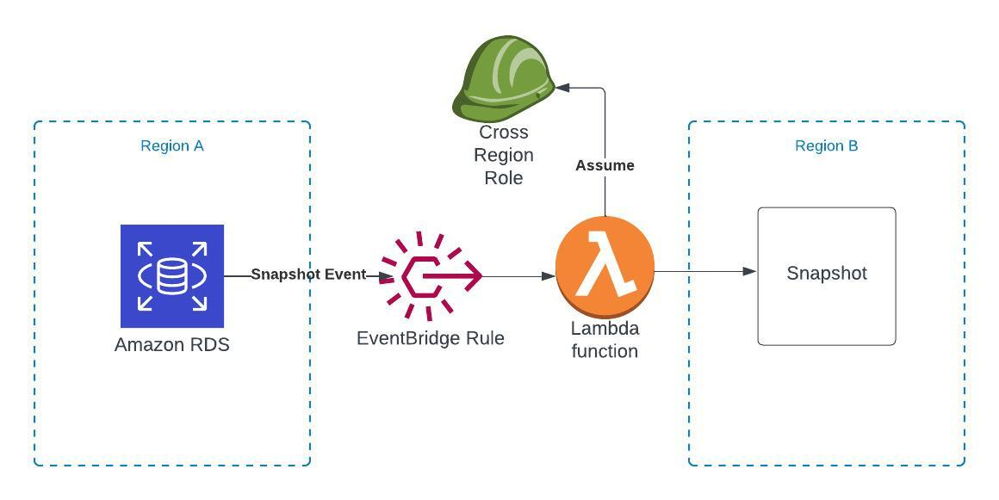
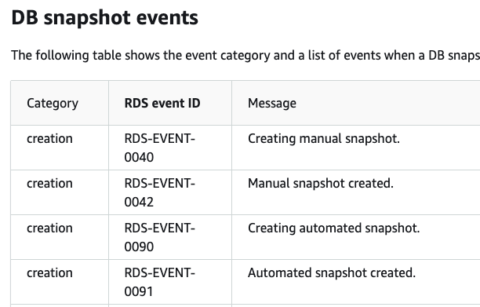
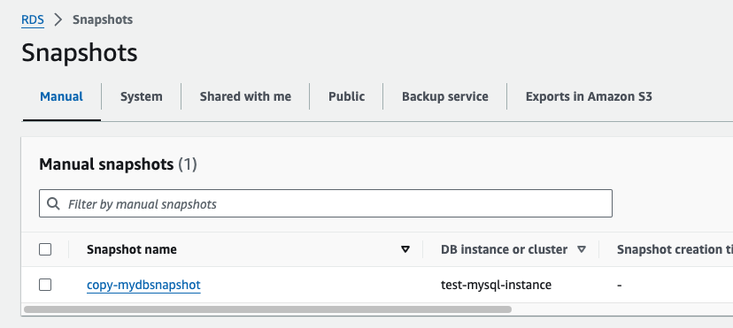

When it comes to disaster recovery in the cloud, AWS describe [four main options](https://docs.aws.amazon.com/whitepapers/latest/disaster-recovery-workloads-on-aws/disaster-recovery-options-in-the-cloud.html):
- Backup & Restore
- Pilot Light
- Warm Standby
- Multi-size active/active

In this project we will be going through a common backup & restore technique for RDS which involves copying snapshots cross region.

This is a preventative measure in case an availability zone or entire region would go down. Even if the RPO / RTO is estimated to be hours, the chance of this occurring is quite small so unless your system is highly critical, it is a totally valid option.

For the solution we will be creating an EventBridge rule to listen for the snapshot event.

In [another project](../lambda-start-stop-ec2/README.md) we went through using EventBridge for scheduled tasks, so this is a nice complement to see how to work with events.

It’s a very common pattern and can be applied to a ton of scenarios (listening for EC2 state change events, security findings from security hub, etc).

# Architecture Overview



1. An automatic RDS snapshot triggers an event which is sent to EventBridge.
2. An EventBridge rule matches the incoming event and triggers a lambda function
3. The lambda function uses a cross region role

## Create RDS Instance

We start off by creating the RDS instance since it can take a little while and then we have it ready when we later want to create our snapshot.

```bash
aws rds create-db-instance \
    --db-instance-identifier test-mysql-instance \
    --db-instance-class db.t3.micro \
    --engine mysql \
    --master-username admin \
    --master-user-password secret99 \
    --allocated-storage 20
```

## Create Lambda Role

Now we set up the IAM Role for our Lambda Function with basic permissions. Let's add the rest later when we've reviewed the script.

```bash
echo '{
 "Version": "2012-10-17",
 "Statement": [
   {
     "Effect": "Allow",
     "Principal": {
       "Service": "lambda.amazonaws.com"
     },
     "Action": "sts:AssumeRole"
   }
 ]
}' > LambdaTrust.json
aws iam create-role --role-name RdsCopyLambda --assume-role-policy-document file://LambdaTrust.json

aws iam attach-role-policy --role-name RdsCopyLambda --policy-arn arn:aws:iam::aws:policy/service-role/AWSLambdaBasicExecutionRole
```

The BasicExecutionRole simply gives the Lambda the permission to create a log group and log it's output there.

# Create the Lambda Function

```python
import boto3
import os

def lambda_handler(event, context):
    client = boto3.client('rds', region_name = os.environ["DESTINATION_REGION"])
```

We start off by importing required libraries and instantiating an RDS client.

Note that the client is created for the destination region (eu-west-1 in our case).

```python
    for snapshot_arn in event['resources']:
        arn = snapshot_arn.split(':')
        snapshot_name = arn[-1]
```

We then extract the snapshot name from the event.

And use it to create our snapshot copy.

```python
        response = client.copy_db_snapshot(
            SourceDBSnapshotIdentifier = snapshot_arn,
            TargetDBSnapshotIdentifier = f'copy-{snapshot_name}',
            Tags=[
                {
                    'Key': 'source_region',
                    'Value': os.environ["SOURCE_REGION"]
                }
            ],
            SourceRegion = os.environ["SOURCE_REGION"],
            KmsKeyId = os.environ["DESTINATION_REGION_KMS_KEY_ID"]
        )
        print(response)
```

Note here that we will be requiring a KMS key for our destination region, since they are a regional resource.

# Adding Additional Lambda Permissions

Now that we've seen the script, we know that we will be needing the follow two permissions to access RDS.

```bash
echo '{
   "Version": "2012-10-17",
   "Statement": [
       {
           "Effect": "Allow",
           "Action": [
               "rds:CopyDBSnapshot",
               "rds:AddTagsToResource"
           ],
           "Resource": "*"
       }
   ]
}' > RDSPolicy.json

```

And let's use it to create a policy and attach it to our role.

```bash

aws iam create-policy \
    --policy-name RdsCopyLambda-RDSPolicy \
    --policy-document file://RDSPolicy.json

aws iam attach-role-policy \
    --role-name RdsCopyLambda \
    --policy-arn <policy arn>
```

## Deploy the Lambda Function

One last step before deploying our Lambda Function: create the KMS key in the destination region.

```bash
aws kms create-key --region eu-west-1
```

Now we have everything we need. Make sure to specify a timeout for the lambda function as well as the necessary environment variables.

I chose the maximum of 15 minute timeout for this example, but since our database is empty it will go much quicker.

```
aws lambda create-function \
    --function-name RdsCopyLambda \
    --zip-file fileb://rds_copy_lambda.zip \
    --handler lambda.lambda_handler \
    --runtime python3.9 \
    --role <IAM arn> \
    --timeout 900 \
    --environment 'Variables={SOURCE_REGION=eu-central-1,DESTINATION_REGION=eu-west-1,DESTINATION_REGION_KMS_KEY_ID=<key id>}'
```

# Create EventBridge Rule

In [the documentation](https://docs.aws.amazon.com/AmazonRDS/latest/UserGuide/USER_Events.Messages.html#USER_Events.Messages.snapshot) you can find the relevant event ids for EventBridge, and in our case we want the `RDS-EVENT-0042`. 

Note that this is for manual snapshots. In a real production example we would be using scheduled backups, but manual is simpler to test.



With this we can simply create our EventBridge rule.

```bash
aws events put-rule \
    --name rds-cross-region-copy \
    --event-pattern '{
        "source": ["aws.rds"],
        "detail-type": ["RDS DB Snapshot Event"],
        "region": ["eu-central-1"],
        "detail": {
            "SourceType": ["SNAPSHOT"],
            "EventID": ["RDS-EVENT-0042"]
            }
        }'
```

And also configure the target as our Lambda function

```bash
aws events put-targets \
    --rule rds-cross-region-copy \
    --targets "Id"="1","Arn"="<lambda arn>"
```

Now this part is a bit tricky. The previous command accepts a `RoleArn`, but not when the target is a Lambda Function. Instead we have to add a resource-based policy on the Lambda itself.

There is however a helper command with the CLI to do this a bit more simply.

```bash
aws lambda add-permission \
    --statement-id "InvokeLambdaFunction" \
    --action "lambda:InvokeFunction" \
    --principal "events.amazonaws.com" \
    --function-name "RdsCopyLambda" \
    --source-arn <eventbridge rule arn>
```

# KMS Policy

Before we trigger our solution there is one thing missing: a key policy to allow our Lambda Function access to the key.

Key Policies can be a bit tricky.

The main thing to remember is that the default Policy simply allows our account to manage KMS keys using IAM.

But more our Lambda we will be needing an additional entry.

```bash
echo '{
    "Version": "2012-10-17",
    "Id": "key-default-1",
    "Statement": [
        {
            "Sid": "Enable IAM User Permissions",
            "Effect": "Allow",
            "Principal": {
                "AWS": "arn:aws:iam::<account id>:root"
            },
            "Action": "kms:*",
            "Resource": "*"
        },
        {
            "Sid": "Enable RdsCopyLambda",
            "Effect": "Allow",
            "Principal": {
                "AWS": "arn:aws:iam::<account id>:role/RdsCopyLambda"
            },
            "Action": "kms:*",
            "Resource": "*"
        }
    ]
}' > KeyPolicy.json
```

And then we simply create the key policy like so:

```bash
aws kms put-key-policy \
    --key-id <key id> \
    --policy-name default \
    --policy file://KeyPolicy.json \
    --region eu-west-1
```

# Take RDS Snapshot

Now we are ready to test out our solution.

```bash
aws rds create-db-snapshot \
    --db-instance-identifier test-mysql-instance \
    --db-snapshot-identifier mydbsnapshot
```

Wait until the snapshot finishes creating and then change region to the destination region to see the copied snapshot.



Make sure to check the monitoring sections on the EventBridge rules and Lambda to see that both were invoked like expected.

# Cleaning up

Remember to clean up the resources we've created. Especially:
- Terminate the RDS Instance
- Delete the RDS Snapshot
- Disable / Delete the EventBridge rule

Thanks for reading!