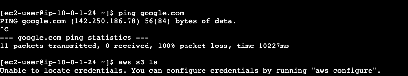

# Intro

In [part 1](../vpc-interface-endpoint/README.md) we had a look at using VPC Interface Endpoints.

The other type of VPC Endpoints are Gateway Endpoints.

These can be used to access DynamoDB or S3.

We will be using an S3 VPC Gateway Endpoint in this example.

Similar to an Interface Endpoint it helps us route traffic using the AWS privatelink network, instead of going over the public internet.

There is a big difference in the implementation however.

Instead of launching an ENI in our subnet, a Gateway Endpoint requires us setting up routing rules in our Route Table.

# Architecture Overview


A VPC Gateway Endpoint allows our private EC2 instance to communicate with S3.
Packets with a target of the AWS S3 server IPs are routed through the VPC Endpoint using our Route Table.
Furthermore, Bucket Policies and VPC Endpoint Policies restrict access.

# Starting Point

Assuming you've followed the steps in [part 1](../vpc-interface-endpoint/README.md), you should be connected to an instance launched in a private subnet without internet connectivity.



# Creating an IAM Role for EC2

In order to access S3, we will need an instance profile for our EC2 instance.

We start, as always, by creating the IAM Role.

```bash
echo '{
 "Version": "2012-10-17",
 "Statement": [
   {
     "Effect": "Allow",
     "Principal": {
       "Service": "ec2.amazonaws.com"
     },
     "Action": "sts:AssumeRole"
   }
 ]
}' > EC2Trust.json

aws iam create-role \
    --role-name InstanceARole \
    --assume-role-policy-document file://EC2Trust.json
```

And now we add a simple policy allowing all S3 access just for demo purposes.

```bash
echo '{
   "Version": "2012-10-17",
   "Statement": [
       {
           "Effect": "Allow",
           "Action": [
               "s3:*"
           ],
           "Resource": "*"
       }
   ]
}' > EC2S3Policy.json

aws iam create-policy \
    --policy-name EC2S3Policy \
    --policy-document file://EC2S3Policy.json

aws iam attach-role-policy \
    --role-name InstanceARole \
    --policy-arn <policy arn>
```

# Creating an Instance Profile

Now we have to create the Instance Profile and associate it with the IAM Role.

```bash
 aws iam create-instance-profile --instance-profile-name InstanceA
 aws iam add-role-to-instance-profile \
    --role-name InstanceARole \
    --instance-profile-name InstanceA
```

And finally we can associate the Instance Profile with our running instance.

```bash
aws ec2 associate-iam-instance-profile --instance-id $INSTANCE_A --iam-instance-profile Name=InstanceA
```

Now, log on to the InstanceA using EC2 Instance Connect, and try connecting to S3.

```bash
aws s3 ls --region eu-central-1
```

It still hangs. 

This is because, by default any call to the AWS API is routed over the public internet. We will be needing a VPC Gateway in order to route the traffic within our VPC since we do not have an Internet Gateway in our VPC.

# Create the VPC Gateway for S3

Find your Route Table for VPC A either through the console, or by using the CLI.


And use this entry to create our VPC Gateway Endpoint for S3.

```bash
aws ec2 create-vpc-endpoint \
    --vpc-id $VPC_A \
    --service-name com.amazonaws.eu-central-1.s3 \
    --route-table-ids <route table id>
```
# Enable Amazon DNS

In order for DNS to correctly resolve to the right IP addresses we will be needing to modify our VPC by changing two settings. These can be found in the documentation [here](https://docs.aws.amazon.com/vpc/latest/userguide/vpc-dns.html#vpc-dns-support).

```bash
aws ec2  modify-vpc-attribute \
    --vpc-id $VPC_A \
    --enable-dns-hostnames 
aws ec2  modify-vpc-attribute \
    --vpc-id $VPC_A \
    --enable-dns-support
```

The important part from the documentation is the following:
> If at least one of the attributes is set to false, the following occurs:
> The Amazon Route 53 Resolver cannot resolve Amazon-provided private DNS hostnames.

# Setting up Routing

Great, now we have a VPC Gateway Endpoint, but we still need to connect it to configure our route table to forward traffic to the VPC Endpoint when we send requests to the AWS S3 API.

Go to the route table for VPC A and edit the routes.


You'll find the prefix list for S3 for your region in the dropdown under `Destination`. Now, under `Target`, choose the VPC Gateway Endpoint.

When you're done it should look something like this:


# Trying it Out

Connect to the EC2 instance again using EC2 Connect and try listing buckets in your region.

```bash
aws s3 ls --region eu-central-1
```

Now, let's create a bucket and explore some additional configuration.

```bash
aws s3 mb s3://mybucket-asdasdkl21lk1 --region eu-central-1
```

# Add a Bucket Policy to Restrict Access

If we want, we can make sure all access to our bucket is performed through our VPC Endpoint, by adding a Bucket Policy.

```bash
echo '{
  "Version": "2012-10-17",
  "Statement": [
    {
      "Sid": "Allow-access-to-specific-VPCE",
      "Effect": "Deny",
      "Principal": "*",
      "Action": ["s3:*"],
      "Resource": ["arn:aws:s3:::mybucket-asdasdkl21lk1",
                   "arn:aws:s3:::mybucket-asdasdkl21lk1/*"],
      "Condition": {
        "StringNotEquals": {
          "aws:sourceVpce": "vpce-02690a17f4a9b618e"
        }
      }
    }
  ]
}' > BucketPolicy.json

aws s3api put-bucket-policy --bucket mybucket-asdasdkl21lk1 --policy file://BucketPolicy.json
```

Now, try listing buckets from AWS Cloudshell or your local computer.

```bash
[cloudshell]$ aws s3 ls s3://mybucket-asdasdkl21lk1

An error occurred (AccessDenied) when calling the ListObjectsV2 operation: Access Denied
```

We're not allowed to perform the action because of the Bucket Policy.

From our instance everything is working as before though.

```bash
touch test.txt
aws s3 cp test.txt s3://mybucket-asdasdkl21lk1 --region eu-central-1
aws s3 ls s3://mybucket-asdasdkl21lk1 --region eu-central-1

aws s3 mb s3://mybucket-otherbucket-abcd1234 --region eu-central-1
```

# Add an Endpoint Policy to Restrict Access to a Single Bucket

We can also specify an Endpoint Policy to restrict how our Endpoint is used.

For instance, we can limit which resources actions can be performed on in S3.

```bash
echo '{
  "Version": "2012-10-17",
  "Statement": [
    {
      "Sid": "Allow-access-to-specific-bucket",
      "Effect": "Allow",
      "Principal": "*",
      "Action": [
         "s3:*"
      ],
      "Resource": [
        "arn:aws:s3:::mybucket-asdasdkl21lk1",
        "arn:aws:s3:::mybucket-asdasdkl21lk1/*"
      ]
    }
  ]
}' > VpcEpPolicy.json

aws ec2 modify-vpc-endpoint \
    --vpc-endpoint-id vpce-02690a17f4a9b618e \
    --policy-document file://VpcEpPolicy.json
```

Here we limit ourselves to only be able to access a single bucket.

Now, from our instance we can only see our initial bucket, not the `otherbucket`.


# Cleaning Up

Thanks for following around in the second part of this [3 part](../vpc-peering/README.md) series.

If you're hungry for more, take a look at the VPC Peering project as well.

If you're done for the day, make sure to clean up the resources we've created:
- EC2 Instance
- VPC Endpoints
- S3 Bucket

Thanks for reading!