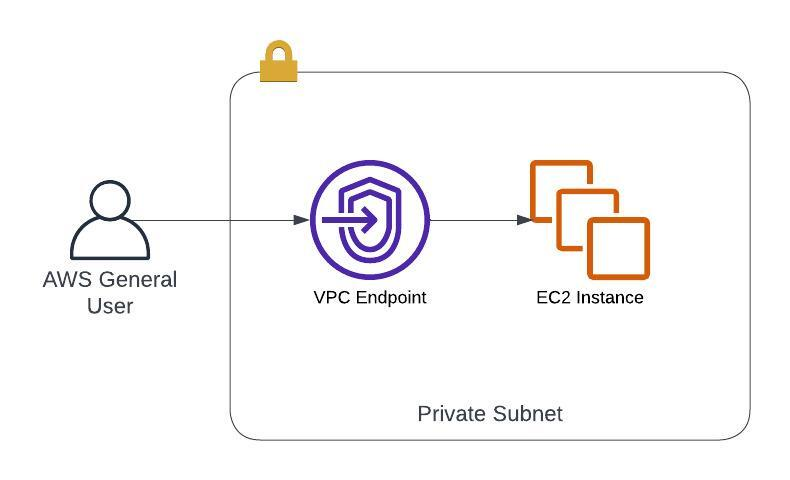
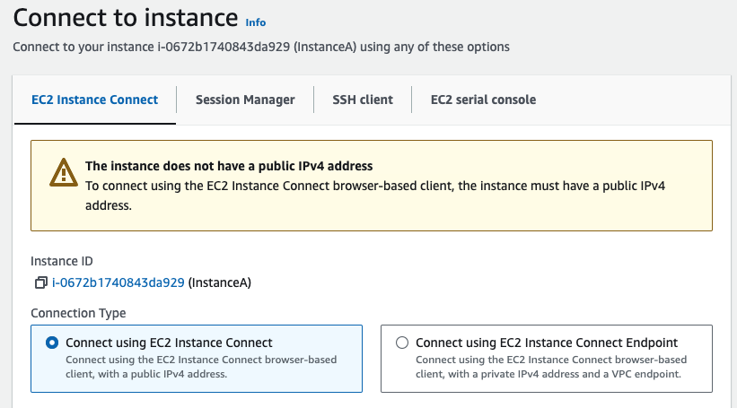
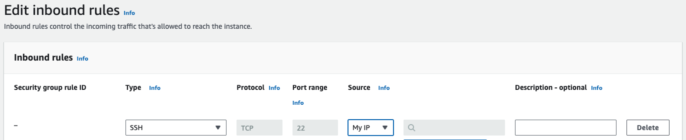
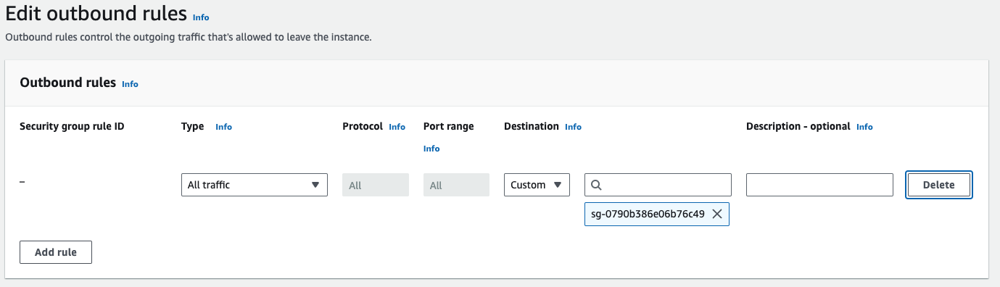
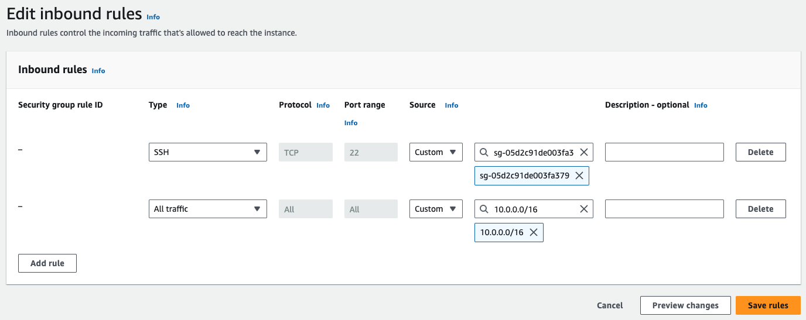
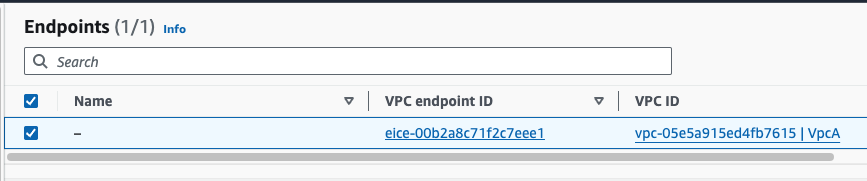
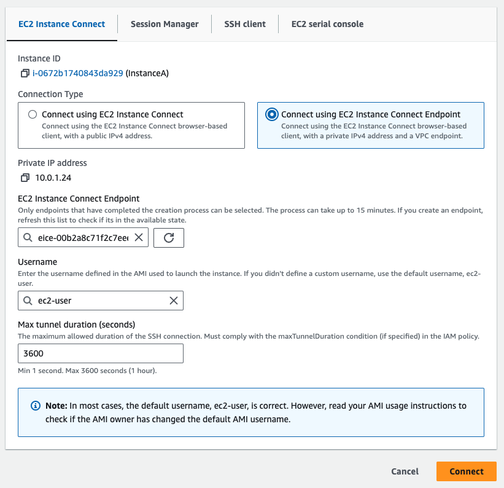

# Intro

Whenever we send a request to the AWS API, for instance S3, SQS, SNS we by default use the public internet. In order to instead use amazon's internal private network, we can use VPC Endpoints.

VPC Endpoints come in two types:
- Gateway Endpoints
- Interface Endpoints

They both function quite differently, and we'll be taking a look at both.

In this first project we'll use an Interface Endpoint to connect EC2 Instance Connect to a private EC2 instance.

Interface endpoints are basically an ENI launched in a chosen subnet. And we can use it to set up communication between our private subnet and the outside world.

# Architecture Overview



A VPC Interface Endpoint is launched in the same subnet as our private instance.
This enables us to use it as an intermediary to connect to our private instance using EC2 Instance Connect.

# Creating a VPC with Subnet
To kick things off we need a VPC to work with. A VPC Endpoint is basically a Network Interface which is deployed into a subnet. So let's start by creating a VPC and tagging it so we can find it in the UI.

```bash
aws ec2 create-vpc --cidr-block 10.0.0.0/16
export VPC_A=<vpc id>
aws ec2 create-tags --resources $VPC_A --tags Key=Name,Value=VpcA
```
Make sure to export the vpc id so we can reference the variable later.

Now, create a subnet in VPC A. Again, export the subnet id and tag the subnet as well.
```bash
aws ec2 create-subnet --vpc-id $VPC_A --cidr-block 10.0.1.0/24
export SUBNET_A=<subnet id>
aws ec2 create-tags --resources $SUBNET_A --tags Key=Name,Value=PrivateSubA
```

# Launching our EC2 Instance
Great, now we can launch an EC2 instance in the created subnet.

Note that we have not attach an internet gateway to the VPC so the instance will have no internet connectivity.

```bash
aws ec2 run-instances \
    --image-id ami-023432ac84225fefd \
    --instance-type t3.micro \
    --subnet-id $SUBNET_A
export INSTANCE_A=<instance id>

aws ec2 create-tags --resources $INSTANCE_A --tags Key=Name,Value=InstanceA
```

We can try to connect to the instance using EC2 Connect, but it requires that our instance has a public IP.



To solve this we will be creating a VPC Endpoint to use kind of like a jump host to get onto our private instance.

# Implementing Security Group Best Practices

First, let's create a security group for the VPC Endpoint and one for the EC2 instance.

```bash
aws ec2 create-security-group \
    --group-name VPCEndpointSG \
    --description VPCEndpointSG \
    --vpc-id $VPC_A

aws ec2 create-security-group \
    --group-name InstanceA \
    --description InstanceA \
    --vpc-id $VPC_A
```

According to [the documentation](https://docs.aws.amazon.com/AWSEC2/latest/UserGuide/eice-security-groups.html#eice-security-group-rules) there are a couple best practices to implement regarding the Security Groups.

For the VPC Endpoint we make sure that the inbound rules simply allow SSH traffic from our personal IPs


And for outbound we allow all traffic to the InstanceA Security Group.


For the InstanceA Security Group we make sure to allow all traffic within our VPC CIDR range. And add the security group for the VPC Endpoint for good measure. 



It is important to allow the Security Group for the VPC Endpoint incase we would want to preserve the client IP when accessing our instance through the VPC Endpoint.

We will be skipping that for this tutorial, but just know that in that case we would be connecting using our own IP and the first SG rule wouldn't be valid for us. Hence we need to add the second as well.

# Creating the VPC Endpoint

Now we have everything in place to create our Endpoint to enable connection to our private instance.

```bash
aws ec2 create-instance-connect-endpoint \
    --region eu-central-1 \
    --subnet-id $SUBNET_A \
    --security-group-ids <vpc endpoint sg>
```

And after a minute or two you should see your VPC Endpoint is available.



And logging in to the instance using EC2 instance connect is successful.



# Cleaning up

If you want to stop here I suggest you delete the
- EC2 instance
- VPC Endpoint
- Security Groups

But otherwise we will be continuing in [part 2](../vpc-gateway-endpoint/README.md) with exploring internet gateway and later in [part 3](../vpc-peering/README.md) VPC peering.

Thanks for reading!
