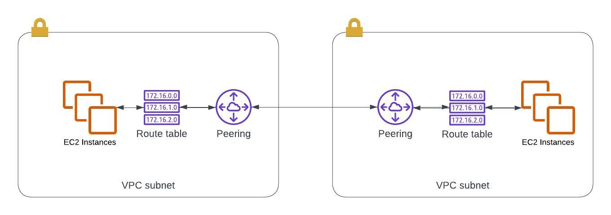
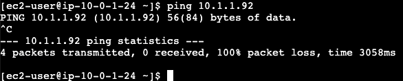
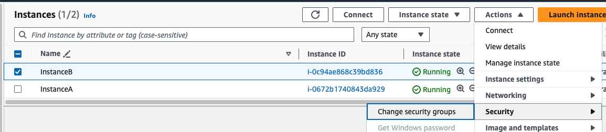
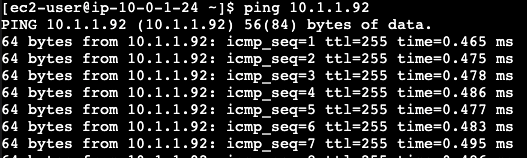

# Intro

In [part 1](../vpc-interface-endpoint/README.md) we used a VPC Interface Endpoint to connect to a private EC2 Instance.

And in [part 2](../vpc-gateway-endpoint/README.md) we tries out using a Gateway Endpoint to connect our private instance to S3 over the Privatelink network.

In this part 3 we will be trying out one last fundamental network concept, which is VPC Peering.

VPC Peering enables us to connect two separate VPCs and make it as if the instances launched within were all part of one big network.

# Architecture Overview



Adding a peering connection enables our instances to communicate cross VPC.
Route Table entries are added to route the packets through the peering connection.

# Starting Point

You don't have to perform the steps in [part 2](../vpc-gateway-endpoint/README.md), but you need to be able to connect to your private instance.

So simply follow along with the steps in [part 1](../vpc-interface-endpoint/README.md) to set up VPC A and connectivity with Instance A.

# Creating our Second VPC

In order to peer two VPCs we will obviously be requiring two VPCs.

We already have our VPC A, so let's create VPC B in a similar fashion.

```bash
aws ec2 create-vpc --cidr-block 10.1.0.0/16
export VPC_B=<vpc id>
aws ec2 create-tags --resources $VPC_B --tags Key=Name,Value=VpcB
```

And again add a subnet to our VPC B.

```bash
aws ec2 create-subnet --vpc-id $VPC_B --cidr-block 10.1.1.0/24
export SUBNET_B=<subnet id>
aws ec2 create-tags --resources $SUBNET_B --tags Key=Name,Value=PrivateSubnetB
```

And let's launch an instance in the subnet as well. We will be using this to try to ping from our instance in VPC A.

```bash
aws ec2 run-instances \
    --image-id ami-023432ac84225fefd \
    --instance-type t3.micro \
    --subnet-id $SUBNET_B
export INSTANCE_B=<instance id>

aws ec2 create-tags --resources $INSTANCE_B --tags Key=Name,Value=InstanceB
```

# Create Peering Connection

Just as a sanity check, let's make sure the connection is not yet working.



Ok, that's what we expected. Let's create our Peering Connection.

```bash
aws ec2 create-vpc-peering-connection \
    --vpc-id $VPC_A \
    --peer-vpc-id $VPC_B
```

Because peering connections can be created between different accounts, it requires that we also accept the Peering Connection. 

In our use case we can simply accept it ourselves, but between two parties one party would invite the other to a connection, and the other party would have to agree to it.

```bash
aws ec2 accept-vpc-peering-connection \
    --vpc-peering-connection-id pcx-0153c6d1d5b17eb2e
```

# Update Route Tables

Similar to when we set up our VPC Gateway Endpoint in part 2, we will again be needing the update our routes in order for the Peering Connection to take effect.

Let's do the update using the CLI this time. 

Start by retrieving some information regarding our two VPCs. We will be needing the CidrBlock in addition to the VPC Ids and also the route table Ids.

```bash
aws ec2 describe-vpcs --vpc-ids $VPC_A --query 'Vpcs[].CidrBlock'
aws ec2 describe-route-tables --filter Name=vpc-id,Values=$VPC_A
```

Now use the values to create our route entries.

We want to make sure than any IP packets heading to the CIDR range for VPC B from VPC A uses the Peering Connection, and the same the other way around on the way back.

```bash
aws ec2 create-route \
    --route-table-id $RT_A \
    --destination-cidr-block $VPC_B_CIDR \
    --vpc-peering-connection-id <peering id>

aws ec2 create-route \
    --route-table-id $RT_B \
    --destination-cidr-block $VPC_A_CIDR \
    --vpc-peering-connection-id <peering id>
```

# Updating our Security Group

One last thing which is easy to forget is to make sure our Security Groups and NACLs are configured correctly.

We've been using the defaults so far, which isn't an issue with the NACL since it defaults to allowing all traffic, but the Security Group needs to be changed for Instance B.

Let's simply make sure we allow all traffic from our InstanceA Security Group

```bash
aws ec2 create-security-group \
    --group-name InstanceB \
    --description InstanceB \
    --vpc-id $VPC_B

INSTANCE_B_SG=<sg id>

aws ec2 authorize-security-group-ingress \
    --group-id $INSTANCE_B_SG \
    --protocol -1 \
    --source-group $INSTANCE_A_SG
```

Now simply update the Security Group for Instance B through the Console.

Select the instance and go to > `Actions` > `Security` > `Change security groups`.



# Try it Out

Finally, we're ready to test our solution.

Log on to InstanceA again using EC2 Instance Connect and try using `ping` to reach the private IP of Instance B.



It works! The packets reach our Route Table, get routed through the Peering Connection, reach Instance B, come back through the Route Table in VPC B, through the Peering Connection, and back to Instance A.

Awesome.

# Cleaning Up

This series has been a ton of fun, hope you've enjoyed it as well. 

Make sure to delete all the resources before you go:
- EC2 Instances
- VPC Endpoints
- Security Groups
- VPCs

Thanks for reading!